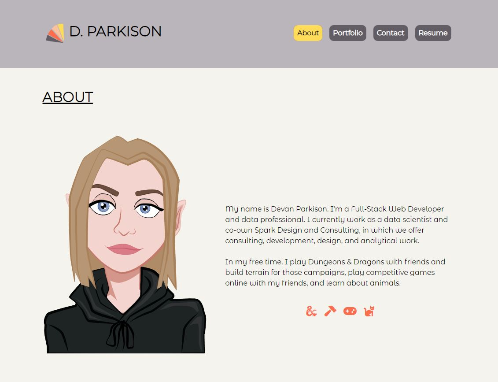

# Parkison Portfolio

[](http://unlicense.org/)

This project was bootstrapped with [Create React App](https://github.com/facebook/create-react-app).

## Description

This is my professional portfolio. Is it a single page React application. It contains four sections: about, projects, contact, and resume. In the about section you can view a short blurb about me, projects display 6 of my recent web development projects, contact is a form that you can fill out in order to get in touch with me, and finally resume contains my downloadable resume, as well as lists of hard and soft skills.

 
## Table of Contents
- [Installation](#installation)
- [Usage](#usage)
- [Credits](#credits)
- [License](#license)

## Installation
In order to use/view this site locally, install all dependencies by running ``` npm i ``` in the terminal. 

## Usage

After installation, you can run `npm start` to run the app in the development mode. Open [http://localhost:3000](http://localhost:3000) to view it in your browser.

The page will reload when you make changes. You may also see any lint errors in the console.

This portfolio is deployed at the following link: [Parkison Portfolio](https://park-d.github.io/parkison-portfolio-react/#portfolio)


## Credits
While working on this project, I worked alongside Jackson Myhre in the same bootcamp class. Utils for email validation and form input validation were adapted from a class example. 

## License
Licensed by The Unlicense
